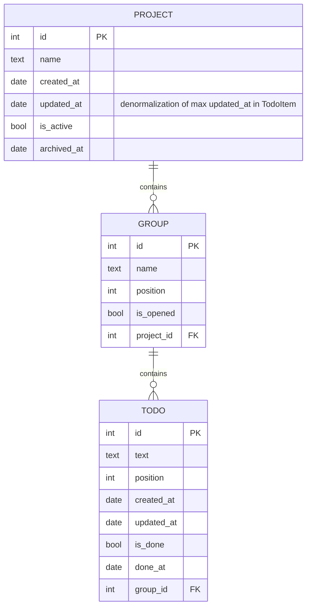

# Todo app

This is simple TODO app written on [Tauri](https://tauri.app) + [React](https://react.dev) + [Typescript](https://www.typescriptlang.org).

## Plan

- [ ] Create projects
- [ ] Show projects
- [ ] Open project
- [ ] Create group
- [ ] Show groups
- [ ] Create item
- [ ] Show items
- [ ] Update items
- [ ] Mark done/undone item
- [ ] Reorder items
- [ ] Move items between groups
- [ ] Update groups
- [ ] Open/close groups
- [ ] Reorder groups
- [ ] Update project
- [ ] Archive project
- [ ] Configure default project groups

## Models

